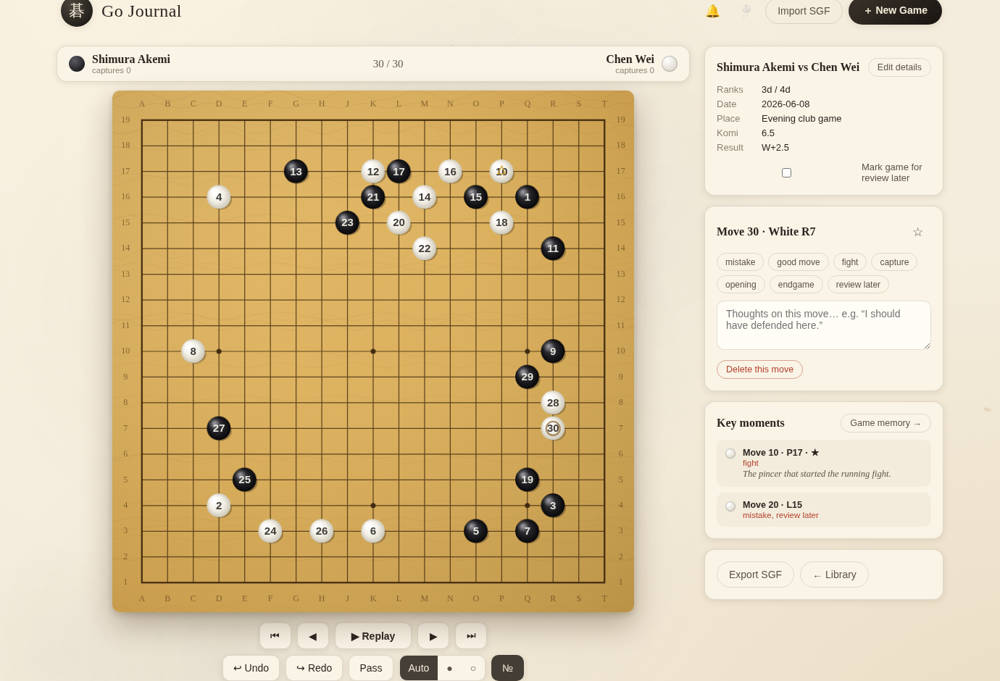

# Go Journal · 棋譜

A beautiful, animated Go / Weiqi game journal. Record your games stone by
stone, replay them cinematically, and review the moments that mattered —
so old games never go to waste.

This is **not** a bot or a tutorial app. It is part board editor, part
replay viewer, part personal study journal, part animated archive.



## Running it

It is a static web app with no build step or dependencies. Serve the
folder with any static file server and open it in a browser:

```bash
# either
npx http-server -p 8080
# or
python3 -m http.server 8080
```

Then visit <http://localhost:8080>. All data is stored locally in your
browser (localStorage) — no account, no network needed.

## Features

**Recording**
- Create games on 9×9, 13×13 or 19×19 boards
- Players, ranks, date, location, komi, result and notes
- Place stones move by move with full rules enforcement
  (captures, suicide, ko / position repetition)
- Pass moves, manual stone-color override (Auto / ● / ○)
- Undo / redo, delete a move (and the variation that follows it)
- Place a stone mid-game to branch into a new variation — the existing
  continuation is kept, and you can switch between branches
- Continue an unfinished game any time — everything autosaves

**Reviewing**
- Jump to any move via the scrubber slider, the animated timeline chips,
  or the arrow keys
- Cinematic replay mode: intro/outro title cards, a low gong, a slow
  breathing zoom, captions, adjustable speed — and it lingers on the
  moves you marked as important
- Per-move notes, bookmarks (★) and tags
  (`mistake`, `good move`, `fight`, `capture`, `opening`, `endgame`, `review later`)
- Key-moments list for quick jumps between marked moves
- "Game memory" summary page: result, final position, captures,
  after-game thoughts and the timeline of important moments
- "Review later" shelf and All / In progress / Finished / Review later
  filters on the library home screen
- Move numbers on stones (toggle), breathing last-move marker,
  capture counters that bump when stones are taken

**Import / export**
- Standard SGF export and import (main line). Notes use `C[]`,
  bookmarks use the standard `HO[]` hotspot property, and tags use a
  custom `TG[]` property that other SGF tools safely ignore.

**Atmosphere**
- Warm speckled wood board with a bevelled rim, soft-drop stone
  animation with bounce, shadow and an impact ripple, smoke-and-ink
  capture dissolve, stones with clamshell texture and natural per-point
  variation, drifting mist and falling-leaf background, paper-grain
  page texture, hover/tap stone preview
- Synthesized sounds — stone click, capture swish, undo lift, save
  chime, replay gong, soft UI ticks — plus an optional ambient pad
  (all WebAudio, no audio files)

**Mobile**
- Fully responsive; on touch screens the first tap previews the stone on
  the nearest intersection and a second tap confirms, so placement is
  always accurate. Move notes and tags live in a slide-up bottom sheet
  behind a floating annotate button that shows a dot when the current
  move already has thoughts on it.

## Keyboard shortcuts (editor)

| Key | Action |
| --- | --- |
| ← / → | previous / next move |
| Home / End | start / latest move |
| Space | start replay · pause/resume |
| Esc | exit replay |
| P | pass |
| N | toggle move numbers |
| B | bookmark current move |
| Ctrl+Z / Ctrl+Y | undo / redo |

## Architecture

```
index.html         scaffolding for the three views + dialogs
css/style.css      ink-painting inspired theme, layout, animations
js/engine.js       pure Go rules engine + editable game record (no DOM)
js/sgf.js          SGF parser / serializer
js/storage.js      localStorage persistence
js/board.js        canvas renderer: wood, stones, animations, input
js/ambient.js      background mist / leaf particle canvas
js/sound.js        WebAudio synthesized SFX and ambient pad
js/icons.js        inline SVG icon set
js/main.js         application controller wiring everything together
test/              node-runnable logic tests
```

`engine.js` keeps a per-move snapshot ("frame") of the board, so jumping
to any move is O(1), and re-validates the whole record after edits —
deleting a stone that enabled a later capture automatically drops the
moves that became illegal.

## Tests

```bash
node test/engine.test.mjs
```

Covers captures, suicide, ko, undo/redo, pass, navigation, mid-game
branching / variations, deletes and SGF round-trips (including variations).
